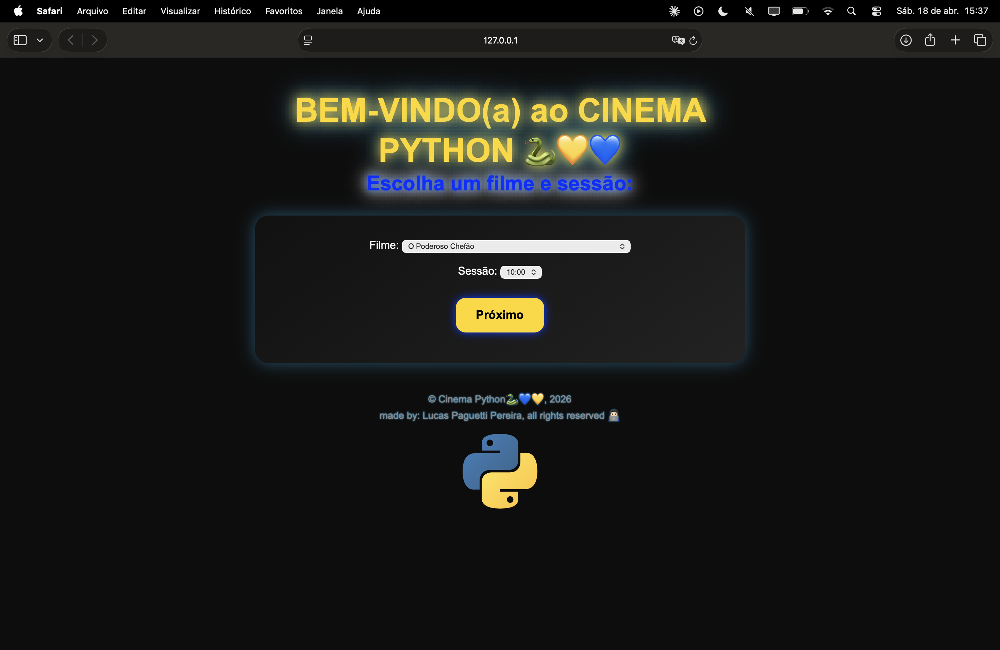
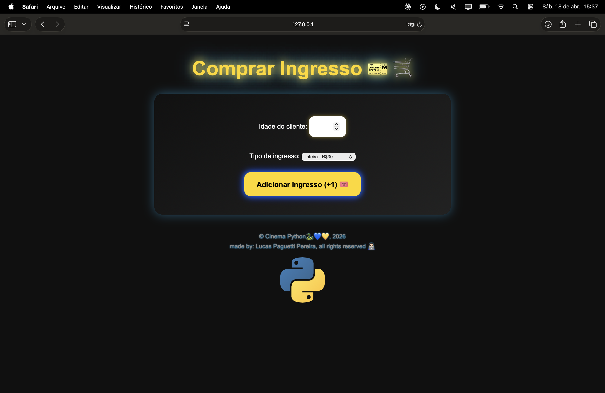
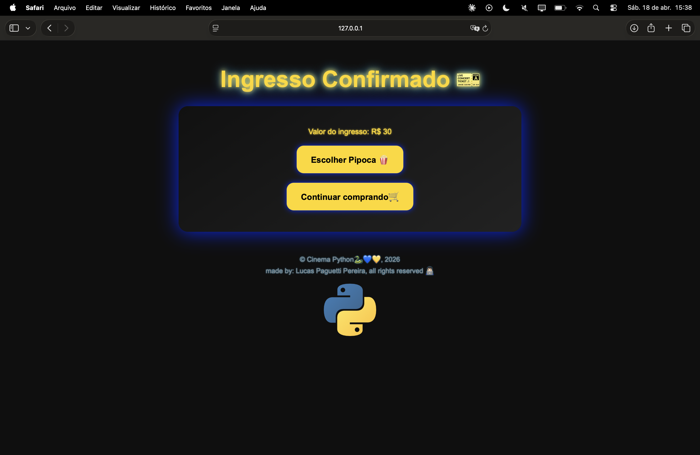
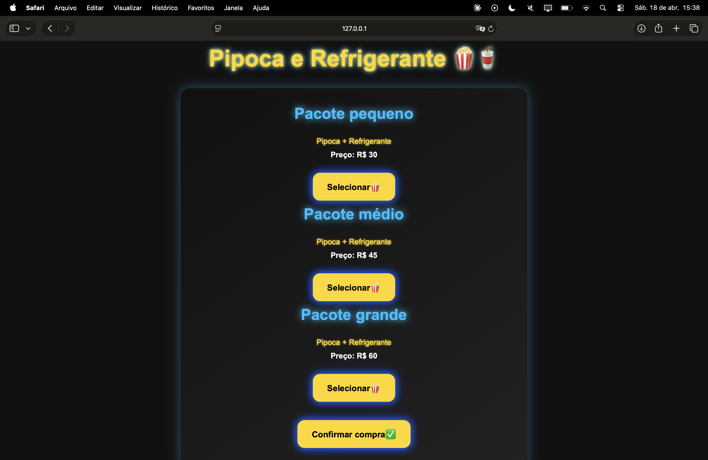
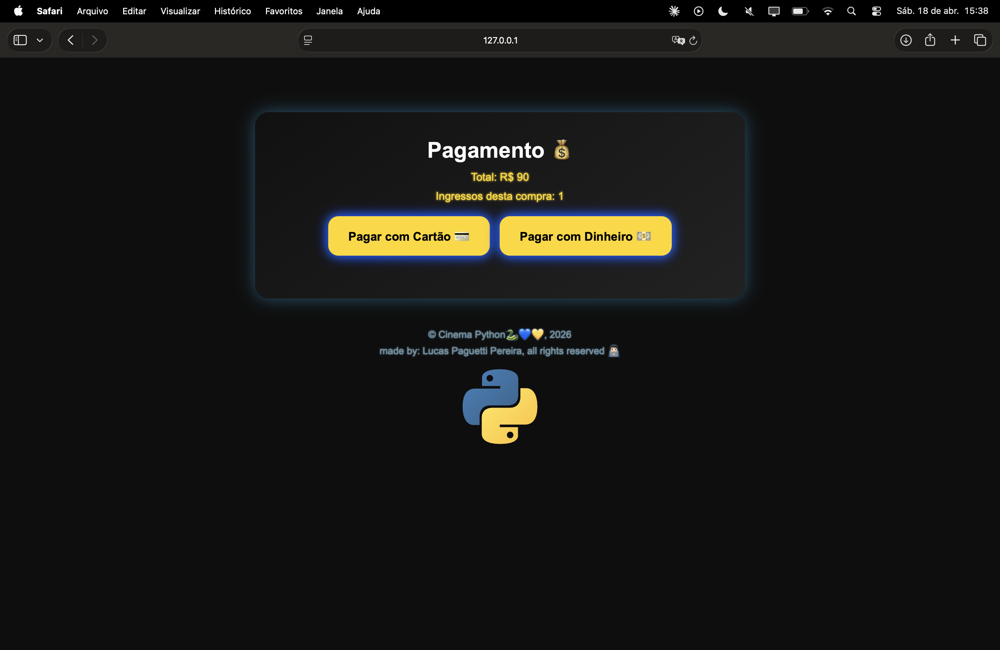
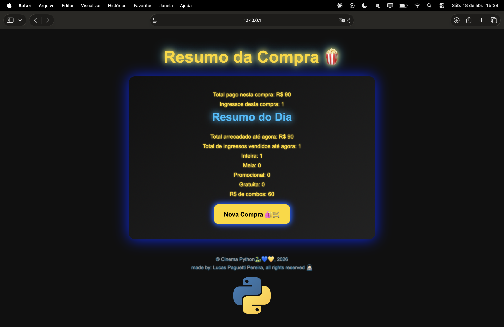

<h1 align="center">🎨 Arquitetura Frontend (Interface e Interação)</h1>
<pre>
Cinema-Python-Flask/
|── FRONTEND/
│   ├── static/
│   │   ├── css/
│   │   └── js/
│   └── templates/
</pre>

<h2 align="left">Estrutura de Templates (Pasta <code>templates/</code>)  
</h2>
Define a estrutura visual das páginas. Utiliza o motor **Jinja2** para criar interfaces dinâmicas, permitindo a injeção de dados vindos do backend diretamente no HTML de forma segura e eficiente.

---

<h2 align="left">Estilização (Pasta <code>static/css/</code>)  
</h2>
Responsável pela camada de apresentação. Define o design, layout, tipografia e responsividade da aplicação, garantindo uma experiência de usuário consistente e polida em diferentes dispositivos.

---

<h2 align="left">Interatividade (Pasta <code>static/js/</code>)  
</h2>
Gerencia a lógica no lado do cliente (Client-Side). Processa eventos de interface, validações imediatas e manipulação do DOM, tornando a navegação mais fluida e interativa para o usuário final.

<h2 align="center" style="font-family: 'Segoe UI', Tahoma, Geneva, Verdana, sans-serif; color: white; text-transform: uppercase; letter-spacing: 2px; border-bottom: 2px solid yellow; padding-bottom: 10px;">
  Visual🍿🎞️ 
</h2>

    
    
    
    
    
  

